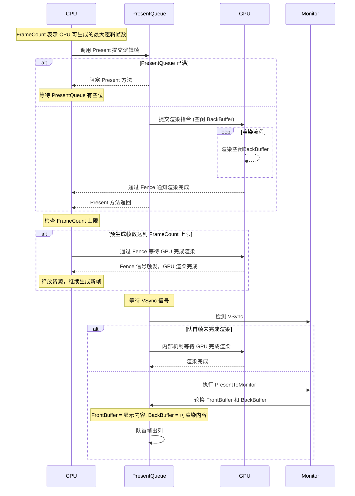

  
  
接下来就要逐步深入 FlipModel 的机制, 先从最常见并且容易理解的概念后台缓冲开始.  

FlipModel 中使用的 Buffer 的目的是, 使用冗余的缓存来削峰填谷, 在帧率波动的时候保证画面平滑. 应用程序特别是游戏, 帧率波动非常正常, 为了防止画面卡顿, 就会使用 Buffer. 因此 Flip Model 项目中使用的 Buffer, 都是用于预渲染   
+ SwapChain::Buffer 交换链的核心, 应用程序的渲染目标 
+ FrameBuffer: CPU 逻辑帧缓存预渲染  
+ PresentQueue: Present 帧缓存

> 虽然与此处的 Buffer 不同, 但是还是提一下, 计算机科学有两种常见的设计思路:  
> 1. 空间换时间: 非常常见的缓存, 也就是 Buffer, 节省读取时间.  
> 2. 局部性原理: 时间空间局部命中高.

## SwapChain Buffer
SwapChain 的 Buffer 作为渲染最终目标, Flip Model 默认防止画面撕裂的情况下, 用于前台呈现的 FrontBuffer 不允许写入. 由 SwapChain 内部机制控制, 并不是显示系统存在硬锁, 让 FrontBuffer 无法写入.  
为了在显示器显示画面的同时, 还能进行预渲染, 就需要 BackBuffer, 但是 BackBuffer 越多, 相应的逻辑帧渲染与显示之间的延迟越高, 也就是所谓的显示延迟.  
  
## Frame Buffer
这里的 Frame 指的是 CPU 可以预生成的渲染逻辑帧, 包含渲染指令和渲染资源. 对于每一个预渲染的帧, 需要额外申请独立的渲染资源, 特别是每一帧都会更改的动态资源(例如 上传堆).   

举例来说, 在一个渲染 Cube 的程序中, Cube 的 Position 信息就是典型的由 CPU 每帧更新, GPU 读取的资源. 如果预渲染帧使用同一个上传堆, 显然最新帧会覆盖旧帧.  

所以, 当预生成的渲染逻辑帧达到上限, 需要等待 GPU 渲染完毕一帧, 释放对应的资源, 才能够  

Frame Buffer 很像 Present Queue, 但是又不完全一样.Frame Buffer 依赖于 CPU 和 GPU 的同步, 管理的是每一帧使用的渲染资源  

## Present Queue
Present Queue 中保存的是需要 Present To Monitor 的预渲染逻辑帧.  
Present Queue 比较特殊的点是, 内部机制同时与 CPU GPU 以及显示子系统相互关联, 并对这些机制进行管理行为.  

Presen Queue 是整个 FlipModel 的核心机制, 已知机制如下:  
1. Present Queue 在满列时, 会阻塞 CPU 调用的 `SwapChain::Present` 方法
2. `SwapChain::Buffer` 在逻辑上分为 FrontBuffer 和 BackBuffer. FrontBuffer 默认情况下(不允许画面撕裂), 不被允许写入.
3. Present Queue 会通过延迟提交渲染指令给 GPU 的方式来"锁住" FrontBuffer.
4. Present Queue 中的帧也必须等待 GPU 渲染完毕才能被 Present To Monitor 

相关的时序图:  

[HowMonitorWorks]: https://www.intel.com/content/www/us/en/developer/articles/code-sample/sample-application-for-direct3d-12-flip-model-swap-chains.html    
[IntelSample]: https://www.intel.com/content/www/us/en/developer/articles/code-sample/sample-application-for-direct3d-12-flip-model-swap-chains.html  
